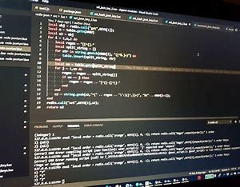

# CUSTOM STYLING

LiaScript allows you to customize the styling of your course by defining custom CSS rules within an HTML comment at the beginning of your document. This feature enables you to change the appearance of various elements, such as headers, paragraphs, and code blocks, to better suit your needs or preferences.

**`Syntax`**

To define custom styling in LiaScript, you can use the following syntax:

```CSS
<!--
<style>
  /* Your custom CSS rules go here */
</style>
-->
```

**`Example`**

Here's an example of how to define custom styling for headers in LiaScript:

```CSS
<!--
<style>
  h1 {
    color: #f00;
    font-size: 3em;
  }

  h2 {
    color: #00f;
    font-size: 2em;
  }
</style>
-->
```

**`Output`**

After applying the custom styling, the headers in your course will be displayed with the specified colors and font sizes. For instance, the following headers:

```
# Header 1
## Header 2
```

Will be rendered as:

```
<h1 style="color: #f00; font-size: 3em;">Header 1</h1>
<h2 style="color: #00f; font-size: 2em;">Header 2</h2>
```


## BLOCK-STYLING

In LiaScript, you can use block-styling to customize the appearance of various block-level elements, such as paragraphs, lists, and blockquotes. This can be done by defining custom CSS rules within an HTML comment at the beginning of your document.

**`Syntax`**

To define block-styling in LiaScript, you can use the following syntax:

```CSS
<!--
<style>
  /* Your custom CSS rules for block-level elements go here */
</style>
-->
```

**`Example`**

Here's an example of how to define block-styling for paragraphs in LiaScript:

```CSS
<!--
<style>
  p {
    color: #f00;
    font-size: 1.2em;
    line-height: 1.5;
  }
</style>
-->
```

**`Output`**

After applying the block-styling, the paragraphs in your course will be displayed with the specified color, font size, and line height. For instance, the following paragraph:

```CSS
This is a paragraph.
```

Will be rendered as:

```html
<p style="color: #f00; font-size: 1.2em; line-height: 1.5;">This is a paragraph.</p>
```

## INLINE-STYLING

In addition to custom styling and block-styling, LiaScript also supports inline-styling. This allows you to apply custom styles to individual elements within your course.

**`Syntax`**

To define inline-styling in LiaScript, you can use the following syntax:

```html
<element style="property: value; property: value;">
```

**`Output`**

After applying the inline-styling, the paragraph will be displayed with the specified color, font size, and line height. For instance, the following paragraph:

```
This is a paragraph.
```

Will be rendered as:

```html
<p style="color: #f00; font-size: 1.2em; line-height: 1.5;">This is a paragraph.</p>
```

Regarding the provided HTML code, it contains an inline-styled text, an image with custom styles, and a video with custom styles. Here's a breakdown of the code:

- The text "This is an important part of the text" has an inline style that sets the color to red.
- The image has custom styles that set its width, border, and class.
- The video has custom styles that apply a blur and grayscale filter to it.

Here's the code with the inline styles and custom styles applied:

This **is an important**<!-- style="color: red" --> part of the text<!-- style="color: green; font-size: 10rem " -->.

<!--style = "width: 300px;border: 10px solid;"class = "animated infinite bounce" -->

Some blurry and black-and-white video:

!?[movie](https://www.youtube.com/watch?v=3pBHX5TGZqc)<!-- style = "filter: blur(2px) grayscale(80%);" -->

CSS is a pretty powerful tool and by using HTML-comments to tweak your Markdown, you can still read the document with any ordinary Markdown interpreter that simply ignores these comments.


## IMAGES AND STYLING

Styling images in LiaScript is common, but it's important to ensure that LiaScript has full control over the images to enable modal view functionality. LiaScript will handle optimal scaling and add click-events to switch to modal view.


**example**


```html

without attribute injection



with attribute are added

<!-- usemap="#workmap" -->

<map name="workmap">
  <area shape="rect" coords="34,44,270,350" title="Computer" onclick="alert('You clicked the Computer')" >
  <area shape="rect" coords="290,172,333,250" title="Phone" href="#12">
  <area shape="circle" coords="337,300,44" title="Cup of coffee" href="#Projects">
</map>
```

**output**


<!-- usemap="#workmap" -->

<map name="workmap">
  <area shape="rect" coords="34,44,270,350" title="Computer" onclick="alert('You clicked the Computer')" >
  <area shape="rect" coords="290,172,333,250" title="Phone" href="#12">
  <area shape="circle" coords="337,300,44" title="Cup of coffee" href="#Projects">
</map>


## WHAT ELSE CAN YOU DO

### HIDING CONTENT

Absolutely, leveraging comments within LiaScript blocks to add additional attributes can be a powerful tool for tailoring content presentation based on different platforms or specific requirements. By including comments with attributes at the beginning of each block, you can control the visibility or behavior of content, such as showing certain parts only on GitHub or providing an alternative view in LiaScript.

Here's a basic example to illustrate this concept:

```
<!-- style="display:block" -->
<div style="display:none">

Visible only in LiaScript, but not on GitHub.

</div>

-----------------------------------------------

<!-- style="display:none" -->
<div style="display:block" id="fooBar">

Not visible in LiaScript, but on GitHub!

</div>
```

By using `{display: none}` and `{display: block}` attributes within comments, you can selectively show or hide content depending on the platform where it's viewed. LiaScript will interpret these comments and adjust the visibility accordingly.


### CUSTOMIZING MULTIMEDIA

Customizing multimedia elements like videos in LiaScript is straightforward, allowing you to control various aspects such as size, autoplay, starting point, and more. If the video is hosted by you, you can use attributes like `autoplay`, `muted`, and additional URL fragments to customize its behavior.

Here's an example demonstrating how to customize a video in LiaScript:


``` markdown
!?[Something about video](https://www.youtube.com/watch?v=3pBHX5TGZqc#t=4,12)<!--
autoplay="true"
muted="true"
-->
```

In this code:

!?[Something about video](https://www.youtube.com/watch?v=3pBHX5TGZqc#t=4,12) creates a clickable thumbnail for the video with the title "Something about math". The video is sourced from the file math.mp4 in the vid directory, and it starts playing from second 4 and stops at second 12.

The comment <!-- ... --> contains attributes to customize the behavior of the video:
autoplay="true" specifies that the video should start playing automatically when it appears.
muted="true" specifies that the video should be muted, which is often required for autoplay functionality to work across browsers.

**Example**

!?[Something about video](https://www.youtube.com/watch?v=3pBHX5TGZqc#t=4,12)<!--
autoplay="true"
muted="true"
-->

#### PLATFORM DIVERSITY

To customize multimedia elements sourced from platforms like YouTube, Vimeo, DailyMotion, PeerTube, or TeacherTube, you can append specific parameters to the URL of the resource. Different platforms may support different parameters, so it's essential to refer to the platform-specific documentation for the available options.

Here's an example demonstrating how to customize multimedia elements from various platforms using URL parameters:

```
!?[Multimedia](url/...?autoplay=1&mute=1&start=1895&end=1905)
```

In this example:

- !?[Multimedia](url/...?autoplay=1&mute=1&start=1895&end=1905) creates a clickable thumbnail for the multimedia content. The URL of the resource is specified with additional parameters appended to it.

- Parameters like autoplay=1 and mute=1 control autoplay and muting behavior.

- The start=1895 parameter specifies the starting point of the video, and end=1905 specifies the ending point.

Different platforms may have different capabilities and support various parameters. It's important to consult the documentation of each platform to determine the available options for customizing multimedia elements. Here are the platforms with their respective URL parameters:

**URL Parameters:**

* [DailyMotion](http://embedcodedailymotion.blogspot.com/2016/05/dailymotion-embed-generator-tdborder.html)
* [Vimeo](https://vimeo.zendesk.com/hc/en-us/articles/360001494447-Using-Player-Parameters)
* [YouTube](https://developers.google.com/youtube/player_parameters)
* PeerTube
* TeacherTube